<div align="center">

# SD高达 G世代 DS · 简体中文汉化构建工程

**SD Gundam G Generation DS**（任天堂 DS，日版）完整独立汉化构建系统<br>
一条命令，把日版卡带镜像转换为完整汉化 ROM。

</div>

<table>
  <tr>
    <td align="center" width="33%">
      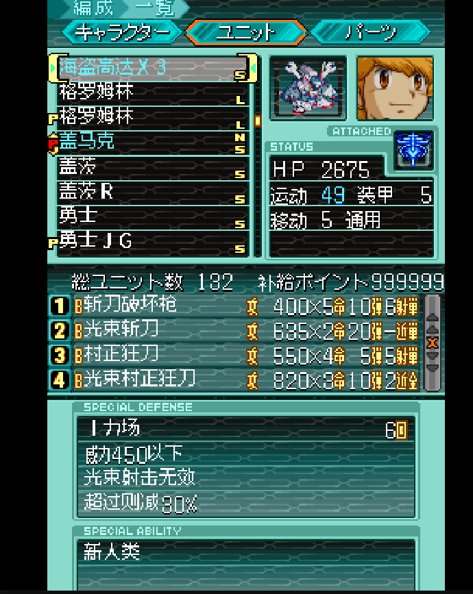<br>
      <sub><b>机体 / 单位界面</b><br>机体名 · 武器 · 特殊防御 · 特殊能力</sub>
    </td>
    <td align="center" width="33%">
      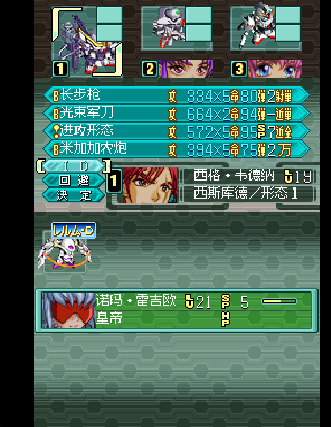<br>
      <sub><b>战斗界面</b><br>武器 · 指令 · 驾驶员信息</sub>
    </td>
    <td align="center" width="33%">
      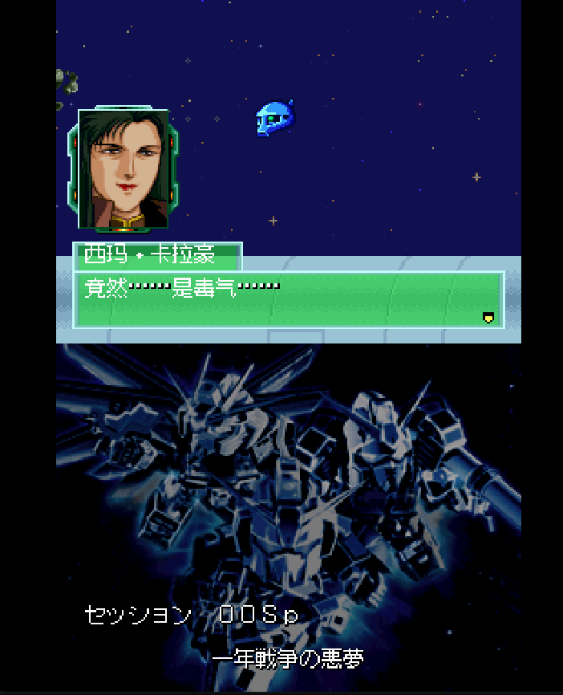<br>
      <sub><b>剧情关卡</b><br>过场对话 · 剧情旁白</sub>
    </td>
  </tr>
</table>

> 机体、武器、驾驶员、战斗、剧情、图鉴与界面——**全流程汉化**，构建结果按哈希逐项校验、可复现。

## v1.2 更新

v1.2 在 v1.1「全文本审校」的基础上更进一步，两条主线：

* **全角色/机体条目重译 + 提取器优先的数据重构** —— 以游戏本体反解出的
  **日文原文为唯一基准**，对全部 **483 个角色与机体条目** 逐条重译并交叉校对
  （经暂存 → 校验 → 落地的工具链应用）；译文按「提取器优先」重新映射进
  `data/zh`，使构建数据与游戏内数组一一对应。配套完成 **解码器全量审校**：
  补全 renderB 界面字体身份表（578 槽位）、对 1068 个在用图集槽位做逐槽身份
  核对，令 `data/jp` 全文零残留乱码。
* **`攻略.html` 以游戏内数据全面重构** —— 见下节，攻略不再只是路线/开发树，
  而是把游戏本体的**剧情对话、作战简报、角色台词与 ID 效果、机体武器与特殊
  能力、图鉴传记**逐字反解收录，**不玩游戏也能通读全部剧情与数据**。

### `攻略.html`：不玩游戏也能读完全部内容

`build/build_guide.py` 从**游戏 ROM 本体**直接反解，并按游戏的两套字体渲染
管线（12×12 图集 renderA / 8×16 界面字体 renderB）**逐字素还原**——日文原文
与中文实机渲染并列。v1.2 把这些内容织入 `攻略.html` 的对应页签，覆盖游戏的
全部叙事与数值，读者无需启动游戏即可通读：

**每一关卡** —— 追加**剧情对话**（按游戏内演出顺序、含说话人）与**作战简报**：

<table>
  <tr>
    <td align="center" width="50%">
      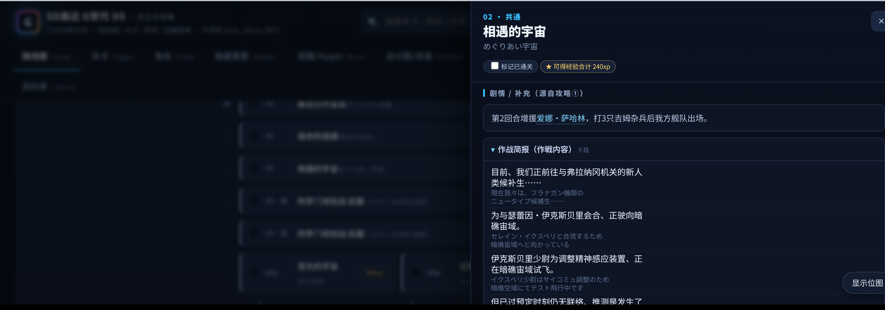<br>
      <sub><b>剧情 / 补充 · 作战简报</b> · 每关的简报正文（作戦内容）逐段还原</sub>
    </td>
    <td align="center" width="50%">
      <br>
      <sub><b>剧情对话</b> · 按游戏内演出顺序、含说话人（如「相遇的宇宙」220 段）</sub>
    </td>
  </tr>
</table>

**每一角色 / 每一机体** —— 角色的**名台词 · ID 指令与效果**、机体的**武器 ·
特殊能力 / 防御**，中文文本与实机中文位图并列（悬停可比日文位图）：

<table>
  <tr>
    <td align="center" width="50%">
      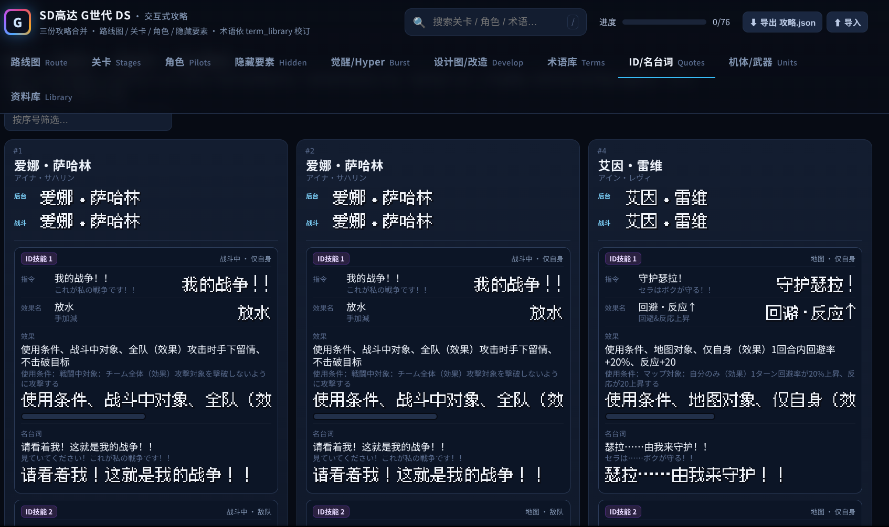<br>
      <sub><b>角色 · ID/名台词</b> · 指令名 · 效果名 · 效果说明 · 名台词</sub>
    </td>
    <td align="center" width="50%">
      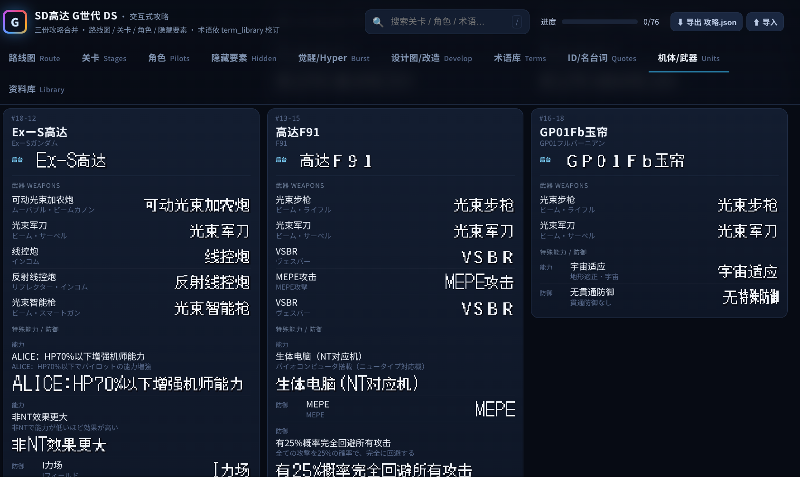<br>
      <sub><b>机体 · 武器/效果</b> · 各武器名 · 特殊能力 · 特殊防御</sub>
    </td>
  </tr>
</table>

## v1.1 更新

* **全文本审校** —— 对话、战斗喊话、ID 技能名与名台词、机体/武器/人物名、
  图鉴全面复核：名台词恢复社区通行完整台词，清除截断式技能名与残留假名，
  译名按大陆主流用法统一 40 余项（布莱特、格雷米、杜加奇、克莱因、捷多、
  亚洲尊者、零式系统、D·特里埃尔 等）。
* **字库重制与补全** —— 12×12 中文字库由 **zpix（最像素）** 全面更换为
  **文泉驿点阵宋体（WenQuanYi Bitmap Song，WQY）**（两者均为开源字体），
  并新增 60+ 简体字形（桥、楼、渣、滓、榴、薙、爵、畅、嫣、飙、β 等），
  全部文本零改写措辞直译落地；修复名牌/武器页的字形错乱
  （多佛炮、光束薙刀、加里波第β 等）。
* **UI 渲染对齐** —— ID/机体/武器页面的中文字形基线与日版逐像素对齐
  （下移 3px），指挥/NT 等级数字与文字同基线，不再浮字或下沉。

<table>
  <tr>
    <td align="center" width="33%">
      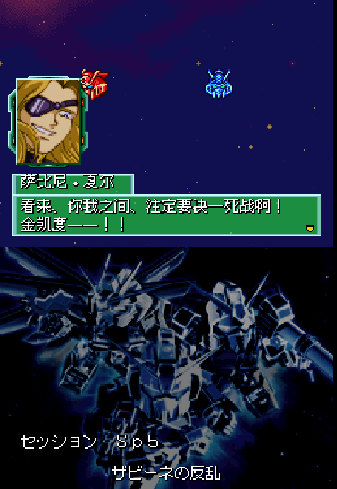<br>
      <sub><b>剧情对话</b><br>关卡过场对话（WQY 新字库）</sub>
    </td>
    <td align="center" width="33%">
      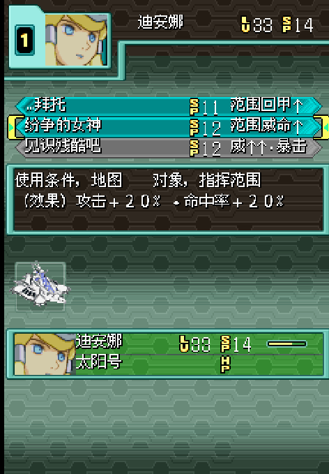<br>
      <sub><b>ID指令页面</b><br>指令名 · 使用条件 · 效果</sub>
    </td>
    <td align="center" width="33%">
      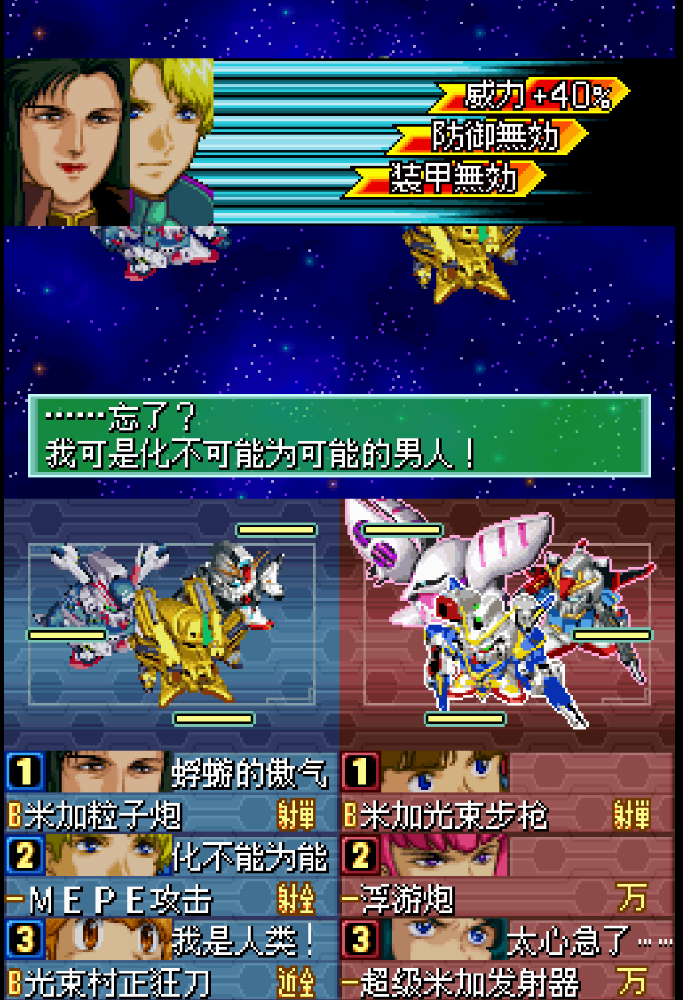<br>
      <sub><b>必杀技名台词</b><br>战斗过场 · 驾驶员名台词</sub>
    </td>
  </tr>
</table>

## 目录结构

```
.
├── 0098 - SD Gundam G Generation DS (Japan).nds   # 日版原始 ROM（输入）
├── sd-gundam-g-generation-zh.nds                  # 汉化 ROM（构建输出）
├── build/          # 构建入口（build.py）、游戏数据提取器（extract_data_from_game.py）
├── data/           # data/jp = 提取的日文原文（机器生成）；data/zh = 汉化映射（人工维护）
│                   # 另含字库（charmap/font）、代码补丁、manifest
├── utils/          # 辅助库（extract/ 提取包、文本编解码、关卡构建、arm9 布局、ROM 读写）
├── test/           # 完整测试套件：静态门禁、模拟器实机、截图、VLM 判图
├── docs/           # 文档：构建指南、数据格式、地址表、经验教训
├── figs/           # README 用截图
└── 攻略.html       # 交互式流程攻略（浏览器打开；隐藏要素/加入条件/开发树）
```

## 快速开始

```bash
# 首次准备
python3 -m venv .venv
.venv/bin/pip install -r requirements.txt

# 构建（输入日版 ROM，输出汉化 ROM）
.venv/bin/python build/build.py "0098 - SD Gundam G Generation DS (Japan).nds" sd-gundam-g-generation-zh.nds
```

预期输出：

```
[build] final ROM sha1 d30ac382e6a31c2560d0949fd4cae7d9a893170a  (MATCHES the shipped translation)
[build] wrote sd-gundam-g-generation-zh.nds  (30,361,448 bytes)
```

追加 `--pad32m 路径` 可同时输出补齐到 32 MiB 的镜像（部分烧录卡要求 2 的幂
大小；sha1 `81d285e1dc2c06c13b157db71e5a9cd952983b62`）。

输入必须是 sha1 为 `12443b91297a57bcd2ace8da989c26ae635a79fd`（33,554,432
字节）的日版卡带镜像——构建会校验它以及 `data/manifest.json` 中记录的每个
中间组件哈希，输入错误或数据损坏都会立刻报错，绝不静默通过。

## 与原版游戏的差异（除汉化外）

在完整汉化之外，本版本相比日版原作有 **三处游戏性改动**：

1. **SP 关卡解锁条件放宽** —— 通关 24 关（24a/24b）之后进入 SP 系列关卡
   （以及后续各 SP 分支）的条件，由原版的 3～4 次索敌（自由战斗）降低为
   **只需 1 次索敌**（全部 7 处解锁判定统一修改）。
2. **永恒号搭载数提升** —— 战舰「永恒号」的搭载量由原版的 2 机改为标准的
   **6 机**（见下图「编成 · 配属」界面，每艘战舰满载 6 机）。注意该数值为
   默认规格：已入手永恒号的旧存档沿用存档内既有的编组槽位，新入手的才按
   6 机计。
3. **倒X（ターンX）获得移除等级门槛** —— 第三路线 10SP：先击坠月光蝶形态
   的金卡拉姆使「倒X」变回普通形态，再由 8 名合资格驾驶员（特列斯／杰克斯／
   ゼロ／瑟蕾因／捷利特／松永／莱汀／西玛）之一、不组队击坠普通形态即可
   获得「倒X」。原版额外要求该驾驶员 **等级 30 以上**，本版本移除此门槛——
   **任意等级** 击坠即可获得（8 人共用同一段获取判定，改动一处即对全部
   8 人生效）。

<div align="center">
  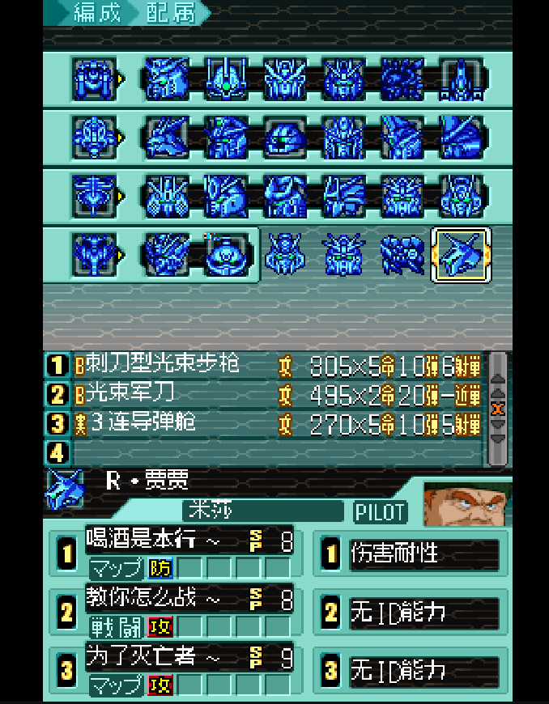<br>
  <sub><b>编成 · 配属界面</b> —— 每艘战舰可搭载 <b>6 机</b>（永恒号搭载数已由 2 提升至标准的 6）</sub>
</div>

三处改动均以数据形式收录并有文档记载：索敌次数见
`data/patches/code_patches.json`，永恒号搭载数见 `data/zh/units.json`
（`carrier_capacity` 字段），倒X等级门槛见
`data/zh/stages/_STG10SP.json`（`kind: "gameplay"` 的字节改动，
偏移 `0xcecd`：`PUSH #30`→`PUSH #0`）；详情见 `docs/GAME_NOTES.md` 与
`docs/ROM_STRUCTURE.md`。

## 校验构建结果

```bash
.venv/bin/python test/run_static.py sd-gundam-g-generation-zh.nds             # 静态门禁，数秒
.venv/bin/python test/live/test_boot_render.py sd-gundam-g-generation-zh.nds  # 模拟器启动测试
```

完整的测试层级（静态 → 模拟器实机 → 截图基准 → VLM 判图）及其依赖见
`test/README.md`。

## 构建流程说明

单次确定性流程（详见 `docs/BUILD_GUIDE.md`）：

1. **代码段（arm9）** —— 将汉化后的名称表（机体、武器、驾驶员、ID指令、
   能力、部件）、界面标签、文本宏字典、字符串池及剧情/作战简报文本写入
   日版镜像；应用约 36 处有文档记载的代码补丁（渲染路径修正与游戏性
   调整）；将 12×12 中文字库图集和两个重定位字符串库作为开机自动加载
   数据追加到镜像尾部。
2. **关卡对话** —— 重建全部 101 个 `_STG*.bin` 关卡文件：植入汉化对话块
   （允许增长）、重定位所有绝对指针、保持文件头各表 4 字节对齐。
3. **数据文件** —— 重建 20 个杂项文件：战斗喊话、必杀技名台词、效果/能力
   文本、图鉴介绍、部件名称，以及少量重绘的界面图块。
4. **容器组装** —— 重新组装 ROM 并校验最终 sha1。

## 文档索引

| 文档 | 内容 |
|---|---|
| `docs/BUILD_GUIDE.md` | 构建流程逐步讲解、组件管线、如何修改一条翻译 |
| `docs/DATA_FORMATS.md` | `data/` 下全部数据的格式说明 |
| `docs/ROM_STRUCTURE.md` | NDS 容器、arm9 内存布局、自动加载机制、**完整地址表** |
| `docs/TEXT_SYSTEM.md` | 文本编码、字库图集、渲染器、字典、宽度预算 |
| `docs/STAGE_FORMAT.md` | 关卡文件格式：对话块、指针、增长、对齐 |
| `docs/GAME_NOTES.md` | 游戏结构，以及每类文本各自存放的位置 |
| `docs/TRANSLATION_GUIDE.md` | 翻译规范、术语表方法、QA 流程 |
| `docs/TESTING_APPROACH.md` | 测试思想：静态门禁、实机测试、VLM 判图 |
| `docs/LESSONS_LEARNED.md` | 弯路目录：被推翻的判断、崩溃案例及对应防护 |
| `data/README.md` | 数据目录布局与格式速览 |
| `test/README.md` | 各测试层级的运行方法 |
| `攻略.html` | 交互式流程攻略（浏览器直接打开，详见下节） |

## 交互式攻略

`攻略.html` 是随工程附带的一份交互式流程攻略，用浏览器直接打开即可（纯离线
单文件、无需联网）。它把三份攻略合并、并依术语库 `term_library` 校订，分为
**路线图 · 关卡 · 角色 · 隐藏要素 · 觉醒/Hyper Burst · 设计图/改造 · 术语库**
等页签：三条路线全关卡分支、事件/经验、隐藏机体与角色的加入条件、觉醒能力，
以及仿游戏内的机体开发/改造系统树（真·像素原图，可交互查看机体名与改造部件
名）；其中也标注了第三路线 10SP 获得倒X（ターンX）的 8 名合资格驾驶员
（已按游戏数据核对）。

<table>
  <tr>
    <td align="center" width="50%">
      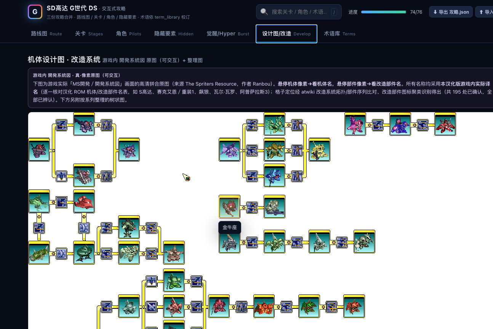<br>
      <sub><b>机体开发 / 改造系统树</b> · 真·像素原图，可交互</sub>
    </td>
    <td align="center" width="50%">
      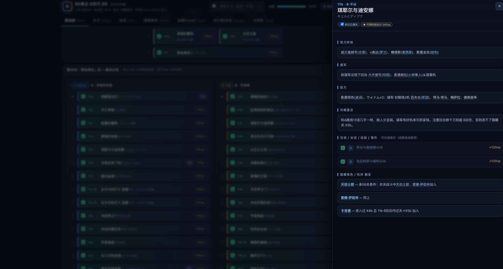<br>
      <sub><b>关卡详情面板</b> · 我方 / 援军 / 敌方 / 攻略要点 / 隐藏加入条件</sub>
    </td>
  </tr>
</table>

攻略内容以 **日版原作机制** 为准；本汉化版的游戏性改动（见上文「与原版游戏的
差异」）在重合处以本 README 为准——例如获得倒X 在本版本为 **任意等级**，
攻略中标注的「LV30 以上」是原版条件。

### 译文审校页签（由游戏本体反解生成）

`攻略.html` 另含 **ID/名台词 · 机体/武器 · 资料库 · 剧情/结局** 等页签，以及在「关卡」
页签每关追加的**作战简报**与**剧情对话**——这些内容并非人工撰写，而是由
`build/build_guide.py` 从 **游戏 ROM 本体** 直接反解、并按游戏的两套字体渲染管线
（12×12 图集 renderA / 8×16 界面字体 renderB）**逐字素还原**，日文原文与中文实机
渲染并列，用于**离线核对翻译质量**（能直接暴露编码/串字问题，而非复述我们的源
文本）。数据取自游戏内数组：角色表 `0xDCF18`、机体主表 `0xB94BC`、ID 指令表
`0xEC994`、名台词链表 `0x16FD64→1dc.bin`、喊话 `0/1/1dd/1de/c4f.bin`、特殊能力/
防御 `1df/1e0.bin`、简报 `0x1985A4→pool B`——不读取 `charmap`/译名标注，纯游戏。
每个人物名并列**两处名牌**（后台一览 renderB 与战斗中 renderA）以便发现两条渲染
路径不一致的串字。

```bash
# 重新生成（读取日版 ROM 与已构建的汉化 ROM，就地增强 攻略.html）
.venv/bin/python build/build_guide.py \
    --jp "0098 - SD Gundam G Generation DS (Japan).nds" \
    --zh sd-gundam-g-generation-zh.nds
```

脚本为确定性纯逻辑（无 VLM / 无联网 / 无外部字体）；文本以浏览器 canvas 按图集
像素绘制，故需支持 `DecompressionStream` 的现代浏览器（Chrome/Edge/Firefox/Safari
新版）。

## 环境要求

* Python ≥ 3.12，构建仅需 `ndspy`；测试另需 `Pillow`/`numpy`。
* 实机测试还需 melonDS、Xvfb 与 xdotool —— 见 `test/README.md`。

## 版权说明

请自行转储持有的日版卡带作为输入。本仓库仅包含汉化数据、工具与文档。
