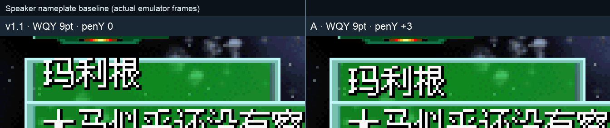
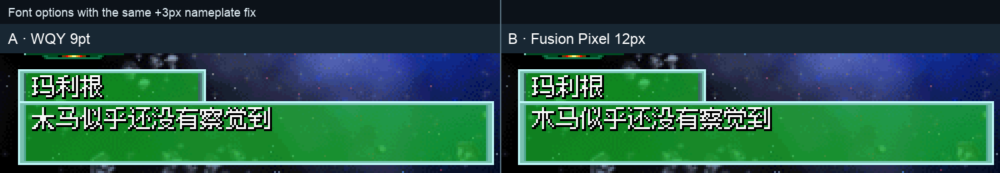

# 中文字形显示方案对照

v1.1 已将中文统一到 12×12 renderA 字库；本次剩余的两个视觉问题应分开处理：

1. 剧情姓名框在改用 12×12 字体后仍保持 `penY=0`，比同类 16px 行框高 3px；
2. WQY 小字号宋体的部分收笔较紧，容易被看成“底部漏笔”。

## 共同修复：姓名框下移 3px

`0x2BCE8` 从 `adds r2,r1,#0` 改为 `movs r2,#3`，只改变姓名框自己的
绘制锚点；剧情正文使用其他调用点，不受影响。

## 方案 A：保留 WQY 9pt

[WenQuanYi Bitmap Song](https://sourceforge.net/projects/wqy/files/wqy-bitmapfont/)
的 `9pt` 指字号，不是 9px；当前 strike 的 advance 为 12px，实际墨迹约
12×11，正好适配游戏的 12×12 cell。它是固定 1-bit 点阵，没有抗锯齿阈值可调；
下一档约 13×12，已无法在保留右下阴影的前提下无损放入当前 cell。

现有 2,085 个 CJK 字模中，1,759 个（84.4%）与官方 WQY9 逐像素一致，
326 个（15.6%）带既有覆盖；只有 66 个（全库 3.2%）的底行墨水少于官方
WQY，本次三张问题截图涉及字符中为 0 个。因此保守方案只应用姓名框 +3px，
不批量重绘字库，避免覆盖已有人工修字。

## 方案 B：统一换用 Fusion Pixel 12px

[Fusion Pixel Font](https://github.com/TakWolf/fusion-pixel-font) 是开源泛中日韩
像素字体，提供原生 12px 简体中文变体；OFL 1.1 允许修改、嵌入与再分发。
本项目固定使用 `2026.05.07` 的 `12px proportional zh_hans`，覆盖 2,085 个
CJK 中的 2,084 个；缺字「赝」保留 WQY 字模，65 个非 CJK 特殊字符保持不变。

游戏仍按 12px 等宽 advance 绘制，并给每个 Fusion 笔画补原版的一像素右下阴影。
这个方案会统一改善全库的小字号观感，但视觉改动面也更大，适合在实机截图确认后
作为独立字体提交审查。

| | 方案 A：WQY | 方案 B：Fusion |
|---|---|---|
| 姓名框 +3px | 是 | 是 |
| 字库改动 | 无 | 2,084 个 CJK 字模 |
| 风险 | 最小 | 需要接受全局视觉变化 |
| 截图中的“漏笔”观感 | 大体保持 | 字形整体更清晰、风格改变 |
| 缺字策略 | 维持现状 | 「赝」回退 WQY；特殊符号保留 |

两张对照图均来自各方案独立构建 ROM 的同一段开场对白、同一模拟器流程；图片只做
整数倍 nearest-neighbor 放大，没有重绘游戏像素。
